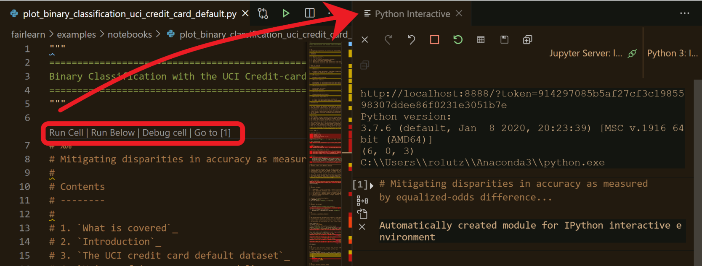

.. _contributing_example_notebooks:

Contributing example notebooks
------------------------------

We'd love to collaborate with anyone interested in describing scenarios for
using Fairlearn!

A good example notebook exhibits the following attributes:

1. **Deployment context**: Describes a real deployment context, not just a
   dataset.
2. **Real harms**: Focuses on real harms to real people.
   See `Blodget et al. (2020) <https://arxiv.org/abs/2005.14050>`_.
3. **Sociotechnical**: Models the Fairlearn team's value that fairness is a
   sociotechnical challenge.
   Avoids abstraction traps.
   See `Selbst et al. (2020) <https://andrewselbst.files.wordpress.com/2019/10/selbst-et-al-fairness-and-abstraction-in-sociotechnical-systems.pdf>`_.
4. **Substantiated**: Discusses trade-offs and compares alternatives.
   Describes why using particular Fairlearn functionalities makes sense.
5. **For developers**: Speaks the language of developers and data scientists.
   Considers real practitioner needs.
   Fits within the lifecycle of real practioner work.
   See `Holstein et al (2019) <https://arxiv.org/pdf/1812.05239.pdf>`_,
   `Madaio et al. (2020) <http://www.jennwv.com/papers/checklists.pdf>`_.

Please keep these in mind when creating, discussing, and critiquing examples.

If you'd like to collaborate, please :ref:`reach out <communication>`.

Formatting of example notebooks
^^^^^^^^^^^^^^^^^^^^^^^^^^^^^^^

The example notebooks in Fairlearn are surfaced through the website's
:ref:`example notebook page <examples>`.
This allows them to be rendered properly with output from all cells.

.. note:

    Rendering the Fairlearn dashboard is still an outstanding issue.

These notebooks are generated based on `.py` files in
`percent format <https://jupytext.readthedocs.io/en/latest/formats.html#the-percent-format>`_
in the
`examples/notebooks directory <https://github.com/fairlearn/fairlearn/tree/master/examples/notebooks>`_
of the repository. To do this yourself make sure to install sphinx and its
add-ons by running :code:`pip install -r requirements.txt` in the repository
root directory.

To build the webpage run the following command from the repository root
directory:

.. code::

    python -m sphinx -v -b html -n -j auto docs docs/_build/html

Rerunning this after making changes to individual files only rebuilds the
changed pages, so the build time should be a lot shorter.

To edit the notebook we recommend using 
`Visual Studio Code <https://code.visualstudio.com/docs/python/jupyter-support>`_.
VS Code recognizes the lines starting with :code:`# %%` as new cells.
Each cell can be executed individually by clicking on *Run Cell*, and VS Code
opens a *Python Interactive* tab to show the output.

If you prefer working with Jupyter simply open the `.py` file with Jupyter.
Changes made in Jupyter automatically show up in the `.py` file.

.. note:

    The Fairlearn dashboard does not render in VS Code yet.
    Jupyter will be required for examples that use the dashboard.

Note that the text portion of these notebooks should be written in
restructured text (ReST), not markdown, so that the sphinx documentation build
can render it nicely for the website. When downloading the `.ipynb` file through
the website the text portions will be in markdown due to automatic conversion from
ReST to markdown by sphinx-gallery. This currently only works for basic ReST
functionality, so try to limit use of ReST directives (e.g., `.. note:`),
internal links (e.g., `:ref:`), and other functionality that won't render well
in markdown.
