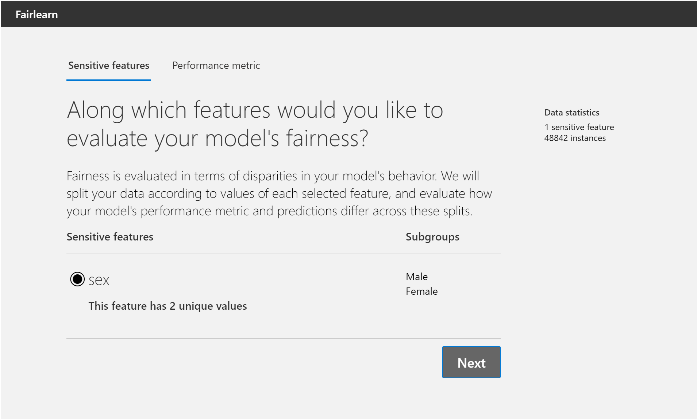
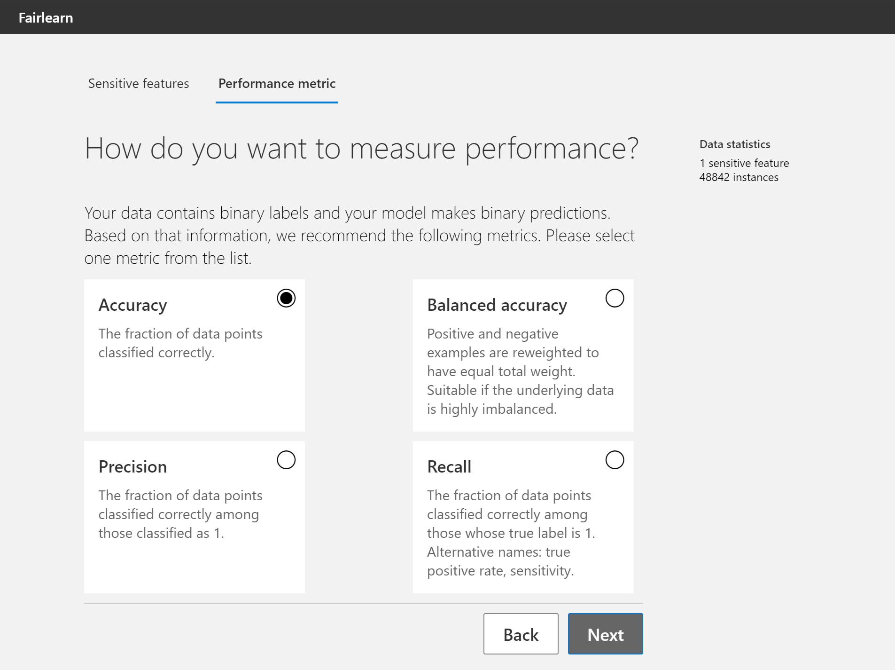
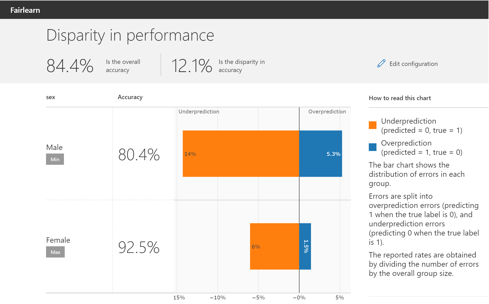
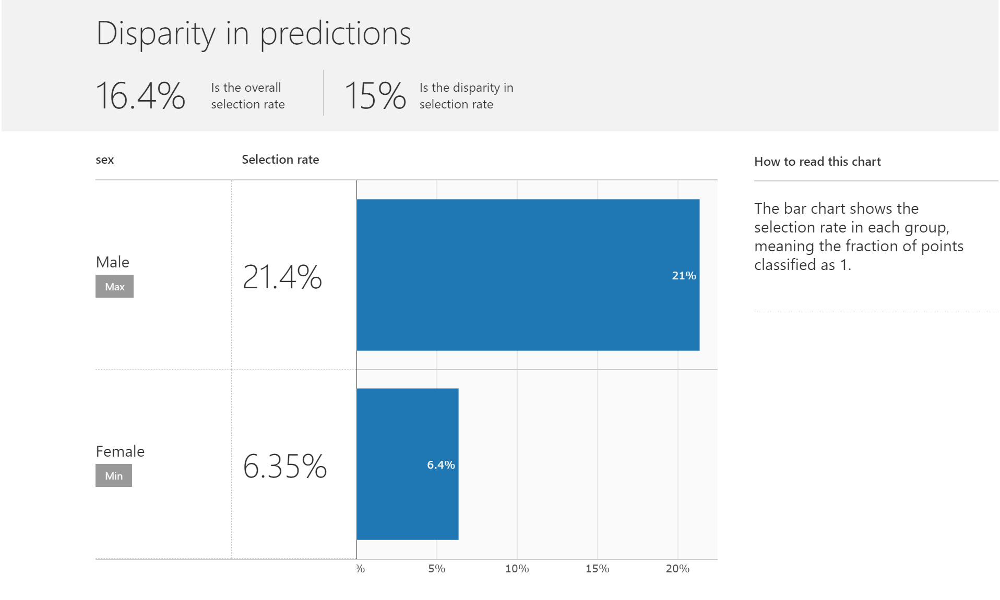
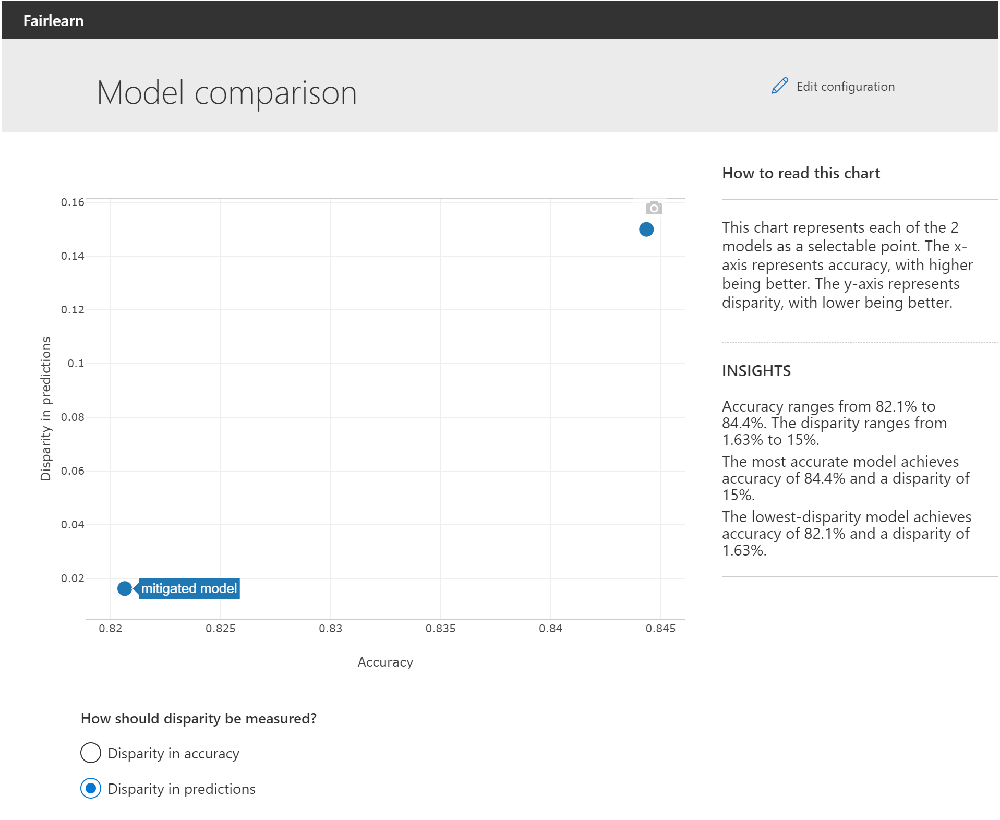

.. _quickstart:

Quickstart
==========

Installation
------------

Fairlearn can be installed with :code:`pip` from
`PyPI <https://pypi.org/project/fairlearn>`_ as follows:

.. code-block:: bash

   pip install fairlearn

Fairlearn is also available on
`conda-forge <https://anaconda.org/conda-forge/fairlearn>`_:

.. code-block:: bash

    conda install -c conda-forge fairlearn

For checking out the latest version in our repository check out our
:ref:`advanced_install`.
If you are updating from a previous version of Fairlearn, please
see :ref:`version_migration_guide`.

.. note::

    The Fairlearn API is still evolving, so example code in 
    this documentation may not work with every version of Fairlearn.
    Please use the version selector to get to the instructions for
    the appropriate version. The instructions for the :code:`main`
    branch require Fairlearn to be installed from a clone of the
    repository. See :ref:`advanced_install` for the required steps.

Overview of Fairlearn
---------------------

The Fairlearn package has two components:

- A *dashboard* for assessing which groups are negatively impacted by a model,
  and for comparing multiple models in terms of various fairness and accuracy
  metrics.

- *Algorithms* for mitigating unfairness in a variety of AI tasks and along a
  variety of fairness definitions.

Fairlearn in 10 minutes
-----------------------

The Fairlearn tookit can assist in assessing and mitigation unfairness in
Machine Learning models. It's impossible to provide a sufficient overview of
fairness in ML in this Quickstart tutorial, so we highly recommend starting
with our :ref:`user_guide`. Fairness is a fundamentally sociotechnical
challenge and cannot be solved with technical tools alone. They may be helpful
for certain tasks such as assessing unfairness through various metrics, or to
mitigate observed unfairness when training a model. Additionally, fairness has
different definitions in different contexts and it may not be possible to
represent it quantitatively at all.

Given these considerations this Quickstart tutorial merely provides short
code snippet examples of how to use basic Fairlearn functionality for those
who are already intimately familiar with fairness in ML. The example below
is about binary classification, but we similarly support regression.

Loading the dataset
^^^^^^^^^^^^^^^^^^^

For this example we use the
`UCI adult dataset <https://archive.ics.uci.edu/ml/datasets/Adult>`_ where the
objective is to predict whether a person makes more (label 1) or less (0)
than $50,000 a year.

.. doctest:: quickstart

    >>> import numpy as np 
    >>> import pandas as pd
    >>> import matplotlib.pyplot as plt 
    >>> from sklearn.datasets import fetch_openml
    >>> data = fetch_openml(data_id=1590, as_frame=True)
    >>> X = pd.get_dummies(data.data)
    >>> y_true = (data.target == '>50K') * 1
    >>> sex = data.data['sex']
    >>> sex.value_counts()
    Male      32650
    Female    16192
    Name: sex, dtype: int64

.. figure:: auto_examples/images/sphx_glr_plot_quickstart_selection_rate_001.png
    :target: auto_examples/plot_quickstart_selection_rate.html
    :align: center

Evaluating fairness-related metrics
^^^^^^^^^^^^^^^^^^^^^^^^^^^^^^^^^^^

Firstly, Fairlearn provides fairness-related metrics that can be compared
between groups and for the overall population. Using existing metric
definitions from
`scikit-learn <https://scikit-learn.org/stable/modules/classes.html#module-sklearn.metrics>`_
we can evaluate metrics for subgroups within the data as below:

.. doctest:: quickstart
    :options:  +NORMALIZE_WHITESPACE

    >>> from fairlearn.metrics import MetricFrame
    >>> from sklearn.metrics import accuracy_score
    >>> from sklearn.tree import DecisionTreeClassifier
    >>> 
    >>> classifier = DecisionTreeClassifier(min_samples_leaf=10, max_depth=4)
    >>> classifier.fit(X, y_true)
    DecisionTreeClassifier(...)
    >>> y_pred = classifier.predict(X)
    >>> gm = MetricFrame(accuracy_score, y_true, y_pred, sensitive_features=sex)
    >>> print(gm.overall)
    0.8443...
    >>> print(gm.by_group)
    sex
    Female    0.9251...
    Male      0.8042...
    Name: accuracy_score, dtype: object

Additionally, Fairlearn has lots of other standard metrics built-in, such as
selection rate, i.e., the percentage of the population which have '1' as
their label:

.. doctest:: quickstart
    :options:  +NORMALIZE_WHITESPACE

    >>> from fairlearn.metrics import selection_rate
    >>> sr = MetricFrame(selection_rate, y_true, y_pred, sensitive_features=sex)
    >>> sr.overall
    0.1638...
    >>> sr.by_group
    sex
    Female    0.0635...
    Male      0.2135...
    Name: selection_rate, dtype: object   

For a visual representation of the metrics try out the Fairlearn dashboard.
While this page shows only screenshots, the actual dashboard is interactive.

.. note::

    The :code:`FairlearnDashboard` is no longer being developed as
    part of Fairlearn.
    The widget itself has been moved to
    `the raiwidgets package <https://pypi.org/project/raiwidgets/>`_.
    Fairlearn will provide some of the existing functionality
    through :code:`matplotlib`-based visualizations.

.. doctest:: quickstart

    >>> from fairlearn.widget import FairlearnDashboard
    >>> FairlearnDashboard(sensitive_features=sex,
    ...                    sensitive_feature_names=['sex'],
    ...                    y_true=y_true,
    ...                    y_pred={"initial model": y_pred}) # doctest: +SKIP

Mitigating disparity
^^^^^^^^^^^^^^^^^^^^

If we observe disparities between groups we may want to create a new model
while specifying an appropriate fairness constraint. Note that the choice of
fairness constraints is crucial for the resulting model, and varies based on
application context. If selection rate is highly relevant for fairness in this
contrived example, we can attempt to mitigate the observed disparity using the
corresponding fairness constraint called Demographic Parity. In real world
applications we need to be mindful of the sociotechnical context when making
such decisions. The Exponentiated Gradient mitigation technique used fits the
provided classifier using Demographic Parity as the objective, leading to
a vastly reduced difference in selection rate:

.. doctest:: quickstart 
    :options:  +NORMALIZE_WHITESPACE

    >>> from fairlearn.reductions import ExponentiatedGradient, DemographicParity
    >>> np.random.seed(0)  # set seed for consistent results with ExponentiatedGradient
    >>> 
    >>> constraint = DemographicParity()
    >>> classifier = DecisionTreeClassifier(min_samples_leaf=10, max_depth=4)
    >>> mitigator = ExponentiatedGradient(classifier, constraint)
    >>> mitigator.fit(X, y_true, sensitive_features=sex)
    ExponentiatedGradient(...)
    >>> y_pred_mitigated = mitigator.predict(X)
    >>> 
    >>> sr_mitigated = MetricFrame(selection_rate, y_true, y_pred_mitigated, sensitive_features=sex)
    >>> print(sr_mitigated.overall)
    0.1661...
    >>> print(sr_mitigated.by_group)
    sex
    Female    0.1552...
    Male      0.1715...
    Name: selection_rate, dtype: object

Similarly, we can explore the difference between the initial model and the
mitigated model with respect to selection rate and accuracy in the dashboard
through a multi-model comparison:

.. doctest:: quickstart

    >>> FairlearnDashboard(sensitive_features=sex,
    ...                    sensitive_feature_names=['sex'],
    ...                    y_true=y_true,
    ...                    y_pred={"initial model": y_pred, "mitigated model": y_pred_mitigated}) # doctest: +SKIP

What's next?
------------

Please refer to our :ref:`user_guide` for a comprehensive view on Fairness in
Machine Learning and how Fairlearn fits in, as well as an exhaustive guide on
all parts of the toolkit. For concrete examples check out the
:ref:`sphx_glr_auto_examples` section. Finally, we also have a collection
of :ref:`faq`.