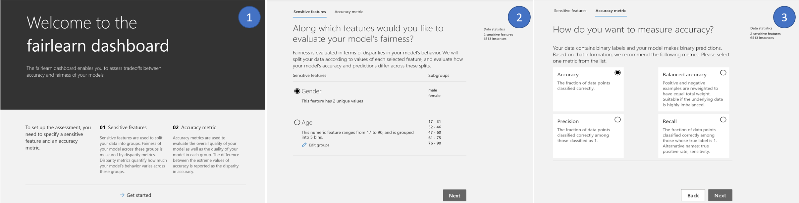
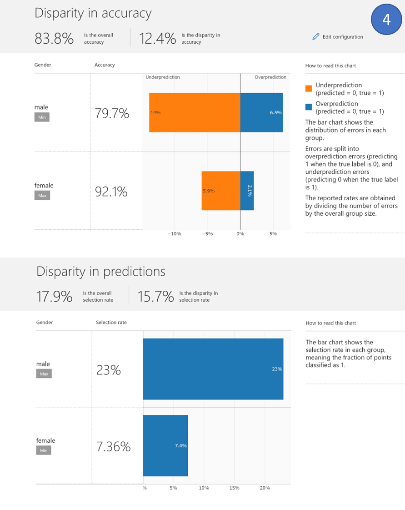
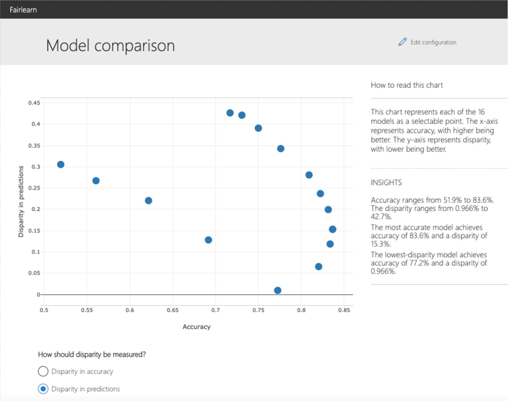

Assessment
==========

Metrics
-------

.. currentmodule:: fairlearn.metrics

.. _dashboard:

Fairlearn dashboard
-------------------

.. currentmodule:: fairlearn.widget

The Fairlearn dashboard is a Jupyter notebook widget for assessing how a
model's predictions impact different groups (e.g., different ethnicities), and
also for comparing multiple models along different fairness and performance
metrics.

Setup and a single-model assessment
^^^^^^^^^^^^^^^^^^^^^^^^^^^^^^^^^^^

To assess a single model's fairness and performance, the dashboard widget can
be launched within a Jupyter notebook as follows:

.. code-block::

    from fairlearn.widget import FairlearnDashboard

    # A_test containts your sensitive features (e.g., age, binary gender)
    # sensitive_feature_names containts your sensitive feature names
    # y_true contains ground truth labels
    # y_pred contains prediction labels

    FairlearnDashboard(sensitive_features=A_test,
                       sensitive_feature_names=['BinaryGender', 'Age'],
                       y_true=Y_test.tolist(),
                       y_pred=[y_pred.tolist()])

After the launch, the widget walks the user through the assessment setup,
where the user is asked to select

#. the sensitive feature of interest (e.g., binary gender or age), and
#. the performance metric (e.g., model precision) along which to evaluate the
   overall model performance as well as any disparities across groups. These
   selections are then used to obtain the visualization of the model's impact
   on the subgroups (e.g., model precision for females and model precision for
   males).

The following figures illustrate the setup steps, where *binary gender* is
selected as a sensitive feature and *accuracy rate* is selected as the
performance metric.

After the setup, the dashboard presents the model assessment in two panels:

.. list-table::
   :header-rows: 0
   :widths: 10 30
   :stub-columns: 1

   *  - Disparity in performance
      - This panel shows: (1) the performance of your model with respect to
        your selected performance metric (e.g., *accuracy rate*) overall as
        well as on different subgroups based on your selected sensitive
        feature (e.g., *accuracy rate* for females, *accuracy rate* for
        males); (2) the disparity (difference) in the values of the selected
        performance metric across different subgroups; (3) the distribution of
        errors in each subgroup (e.g., female, male). For binary
        classification, the errors are further split into overprediction
        (predicting 1 when the true label is 0), and underprediction
        (predicting 0 when the true label is 1).
   *  - Disparity in predictions
      - This panel shows a bar chart that contains the selection rate in each
        group, meaning the fraction of data classified as 1 (in binary
        classification) or distribution of prediction values (in regression).

Comparing multiple models
^^^^^^^^^^^^^^^^^^^^^^^^^

The dashboard also enables comparison of multiple models, such as the models
produced by different learning algorithms and different mitigation approaches,
including :code:`fairlearn.reductions.GridSearch`,
:code:`fairlearn.reductions.ExponentiatedGradient`, and
:code:`fairlearn.postprocessing.ThresholdOptimizer`.

As before, the user is first asked to select the sensitive feature and the
performance metric. The *model comparison* view then depicts the performance
and disparity of all the provided models in a scatter plot. This allows the
user to examine trade-offs between performance and fairness. Each of the dots
can be clicked to open the assessment of the corresponding model. The figure
below shows the model comparison view with *binary gender* selected as a
sensitive feature and *accuracy rate* selected as the performance metric.

