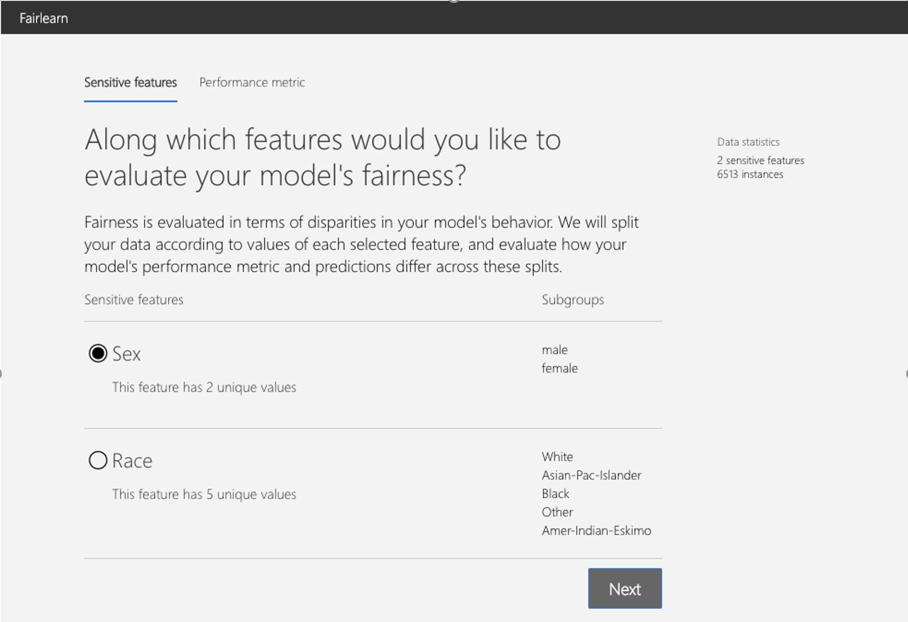
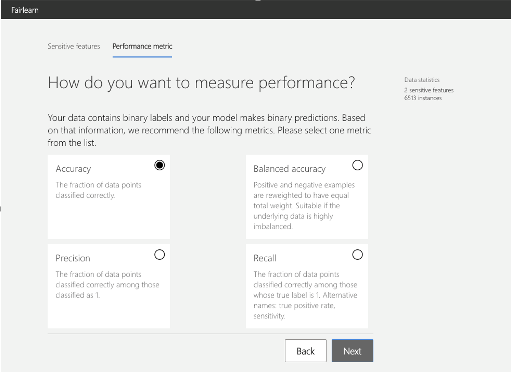
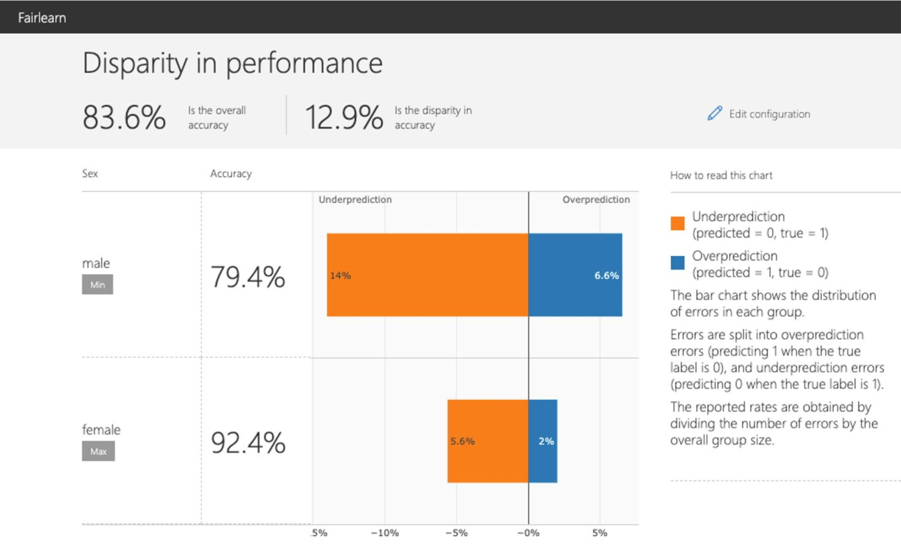

Assessment
==========

Metrics
-------

.. currentmodule:: fairlearn.metrics

The :py:mod:`fairlearn.metrics` module provides the means to assess fairness-related
metrics for models. This applies for any kind of model that users may already
use, but also for models created with mitigation techniques from the
:ref:`mitigation` section. The :ref:`dashboard` provides a visual way to
compare metrics between models as well as compare metrics for different groups
on a single model.

Ungrouped Metrics
^^^^^^^^^^^^^^^^^

At their simplest, metrics take a set of 'true' values :math:`Y_{true}` (from
the input data) and predicted values :math:`Y_{pred}` (by applying the model
to the input data), and use these to compute a measure. For example, the
*recall* or *true positive rate* is given by

.. math::

   P( Y_{pred}=1 \given Y_{true}=1 )

That is, a measure of whether the model finds all the positive cases in the
input data. The `scikit-learn` package implements this in
:py:func:`sklearn.metrics.recall_score`.

Suppose we have the following data we can see that the prediction is `1` in five
of the ten cases where the true value is `1`, so we expect the recall to be 0.5:

.. doctest:: assessment_metrics

    >>> import sklearn.metrics as skm
    >>> Y_true = [0, 1, 1, 1, 1, 0, 1, 0, 1, 0, 0, 0, 1, 1, 1, 1]
    >>> Y_pred = [0, 0, 1, 0, 1, 1, 1, 0, 0, 1, 1, 1, 1, 0, 0, 1]
    >>> skm.recall_score(Y_true, Y_pred)
    0.5

Metrics with Grouping
^^^^^^^^^^^^^^^^^^^^^

When considering fairness, each row of input data will have an associated
group label :math:`g \in G`, and we will want to know how the metric behaves
for each :math:`g`. To help with this, Fairlearn provides wrappers, which take
an existing (ungrouped) metric function, and apply it to each group within a
set of data.

Suppose in addition to the :math:`Y_{true}` and :math:`Y_{pred}` above, we had
the following set of labels:

.. doctest:: assessment_metrics
    :options:  +NORMALIZE_WHITESPACE

    >>> import pandas as pd
    >>> group_membership_data = ['d', 'a', 'c', 'b', 'b', 'c', 'c', 'c',
    ...                          'b', 'd', 'c', 'a', 'b', 'd', 'c', 'c']
    >>> pd.set_option('display.max_columns', 20)
    >>> pd.set_option('display.width', 80)
    >>> pd.DataFrame({ 'Y_true': Y_true,
    ...                'Y_pred': Y_pred,
    ...                'group_membership_data': group_membership_data})
        Y_true  Y_pred group_membership_data
    0        0       0                     d
    1        1       0                     a
    2        1       1                     c
    3        1       0                     b
    4        1       1                     b
    5        0       1                     c
    6        1       1                     c
    7        0       0                     c
    8        1       0                     b
    9        0       1                     d
    10       0       1                     c
    11       0       1                     a
    12       1       1                     b
    13       1       0                     d
    14       1       0                     c
    15       1       1                     c
    <BLANKLINE>

We then calculate a group metric:

.. doctest:: assessment_metrics

    >>> import fairlearn.metrics as flm
    >>> group_metrics = flm.group_summary(skm.recall_score, 
    ...                                   Y_true, Y_pred,
    ...                                   sensitive_features=group_membership_data,
    ...                                   sample_weight=None)
    >>> print("Overall recall = ", group_metrics.overall)
    Overall recall =  0.5
    >>> print("recall by groups = ", group_metrics.by_group)
    recall by groups =  {'a': 0.0, 'b': 0.5, 'c': 0.75, 'd': 0.0}

Note that the overall recall is the same as that calculated above in the
Ungrouped Metric section, while the `by_group` dictionary matches the values
we calculated by inspection from the table above.

In addition to these basic scores, :py:func:`fairlearn.metrics` also provides
convenience functions to recover the maximum and minimum values of the metric
across groups and also the difference and ratio between the maximum and minimum:

.. doctest:: assessment_metrics

    >>> print("min recall over groups = ", flm.group_min_from_summary(group_metrics))
    min recall over groups =  0.0
    >>> print("max recall over groups = ", flm.group_max_from_summary(group_metrics))
    max recall over groups =  0.75
    >>> print("difference in recall = ", flm.difference_from_summary(group_metrics))
    difference in recall =  0.75
    >>> print("ratio in recall = ", flm.ratio_from_summary(group_metrics))    
    ratio in recall =  0.0

Supported Ungrouped Metrics
^^^^^^^^^^^^^^^^^^^^^^^^^^^

To be used by :py:func:`fairlearn.metrics.group_summary`, the supplied Python
function must take arguments :code:`y_true` and :code:`y_pred`: 

:code:`my_metric_func(y_true, y_pred)`

An additional argument of `sample_weight` is also supported:

:code:`my_metric_with_weight(y_true, y_pred, sample_weight=None)`

The :code:`sample_weight` argument is always invoked by name, and *only* if
the user supplies a :code:`sample_weight` argument.

Convenience Wrapper
^^^^^^^^^^^^^^^^^^^

Rather than require a call to :code:`group_summary` each time, Fairlearn also
provides a function which turns an ungrouped metric into a grouped one. This
is called :py:func:`fairlearn.metrics.make_metric_group_summary`:

.. doctest:: assessment_metrics

    >>> recall_score_group_summary = flm.make_metric_group_summary(skm.recall_score)
    >>> results = recall_score_group_summary(Y_true, Y_pred, sensitive_features=group_membership_data)
    >>> print("Overall recall = ", results.overall)
    Overall recall =  0.5
    >>> print("recall by groups = ", results.by_group)
    recall by groups =  {'a': 0.0, 'b': 0.5, 'c': 0.75, 'd': 0.0}

.. _dashboard:

Fairlearn dashboard
-------------------

.. currentmodule:: fairlearn.widget

The Fairlearn dashboard is a Jupyter notebook widget for assessing how a
model's predictions impact different groups (e.g., different ethnicities), and
also for comparing multiple models along different fairness and performance
metrics.

Setup and a single-model assessment
^^^^^^^^^^^^^^^^^^^^^^^^^^^^^^^^^^^

To assess a single model's fairness and performance, the dashboard widget can
be launched within a Jupyter notebook as follows:

.. code-block::

    from fairlearn.widget import FairlearnDashboard

    # A_test containts your sensitive features (e.g., age, binary gender)
    # sensitive_feature_names containts your sensitive feature names
    # y_true contains ground truth labels
    # y_pred contains prediction labels

    FairlearnDashboard(sensitive_features=A_test,
                       sensitive_feature_names=['BinaryGender', 'Age'],
                       y_true=Y_test.tolist(),
                       y_pred=[y_pred.tolist()])

After the launch, the widget walks the user through the assessment setup,
where the user is asked to select

#. the sensitive feature of interest (e.g., binary gender or age), and
#. the performance metric (e.g., model precision) along which to evaluate the
   overall model performance as well as any disparities across groups. These
   selections are then used to obtain the visualization of the model's impact
   on the subgroups (e.g., model precision for females and model precision for
   males).

The following figures illustrate the setup steps, where *binary gender* is
selected as a sensitive feature and *accuracy rate* is selected as the
performance metric.

.. image:: ../../img/fairlearn-dashboard-start.png

After the setup, the dashboard presents the model assessment in two panels:

.. list-table::
   :header-rows: 0
   :widths: 10 30
   :stub-columns: 1

   *  - Disparity in performance
      - This panel shows: (1) the performance of your model with respect to
        your selected performance metric (e.g., *accuracy rate*) overall as
        well as on different subgroups based on your selected sensitive
        feature (e.g., *accuracy rate* for females, *accuracy rate* for
        males); (2) the disparity (difference) in the values of the selected
        performance metric across different subgroups; (3) the distribution of
        errors in each subgroup (e.g., female, male). For binary
        classification, the errors are further split into overprediction
        (predicting 1 when the true label is 0), and underprediction
        (predicting 0 when the true label is 1).
   *  - Disparity in predictions
      - This panel shows a bar chart that contains the selection rate in each
        group, meaning the fraction of data classified as 1 (in binary
        classification) or distribution of prediction values (in regression).

.. image:: ../../img/fairlearn-dashboard-disparity-predictions-multiple-sensitive-features.png

Comparing multiple models
^^^^^^^^^^^^^^^^^^^^^^^^^

The dashboard also enables comparison of multiple models, such as the models
produced by different learning algorithms and different mitigation approaches,
including :code:`fairlearn.reductions.GridSearch`,
:code:`fairlearn.reductions.ExponentiatedGradient`, and
:code:`fairlearn.postprocessing.ThresholdOptimizer`.

As before, the user is first asked to select the sensitive feature and the
performance metric. The *model comparison* view then depicts the performance
and disparity of all the provided models in a scatter plot. This allows the
user to examine trade-offs between performance and fairness. Each of the dots
can be clicked to open the assessment of the corresponding model. The figure
below shows the model comparison view with *binary gender* selected as a
sensitive feature and *accuracy rate* selected as the performance metric.

.. image:: ../../img/fairlearn-dashboard-models.png
